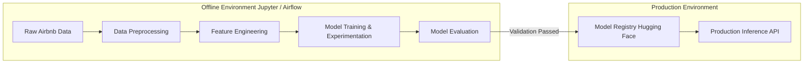

# MLOps Workflow

## Overview
This document outlines the offline-to-online automated pipeline from data ingestion to model deployment. Note that the production platform consumes the model via an inference API; retraining is kept strictly as an offline/research process.

## Pipeline Architecture

## Continuous Monitoring
While we do not retrain automatically, we monitor data drift by comparing the distributions of incoming production inference requests against the baseline training distributions. If significant drift is detected, an alert is sent to the Data Science team to trigger manual retraining.
