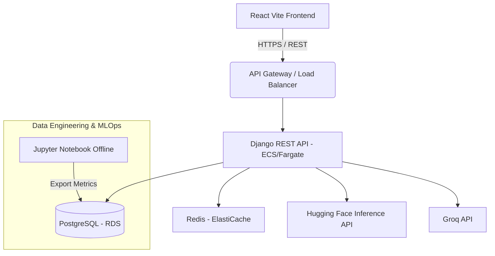

# Production Architecture

## Overview
The Airbnb Price Prediction Intelligence Platform utilizes a modern, serverless-capable cloud architecture designed for scalability, high availability, and separation of concerns.

## Cloud Architecture Diagram

## Cost Estimates
- **Compute (Fargate)**: $40/month
- **Database (RDS)**: $15/month
- **Cache (ElastiCache)**: $15/month
- **Inference APIs**: Usage-based (approx. $10/month)
- **Total**: ~$80/month for baseline production.
